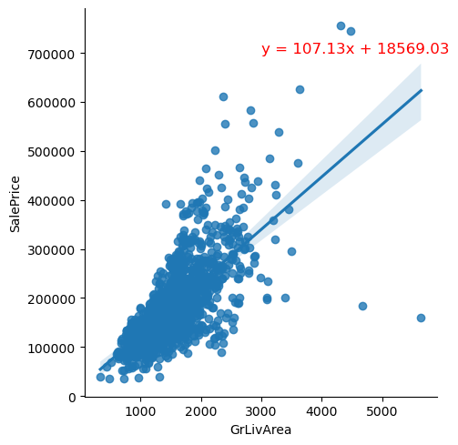
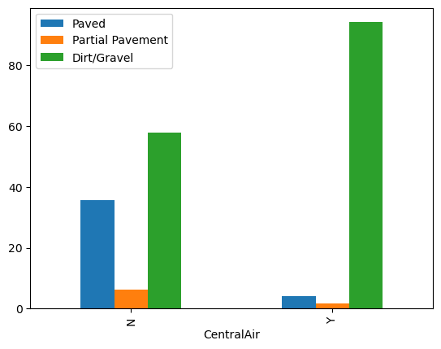

# house_price
## CPSC_house_price_Assignment3_part3

### 1.	Determine the distribution of Dwelling type
a)	Variable BldgType: Type of dwelling, categorical. It consists of '1Fam', '2fmCon', 'Duplex', 'TwnhsE', and 'Twnhs', meaning: Single-family Detached; Two-family Conversion; originally built as a one-family dwelling; End Unit; Townhouse Inside Unit.

b)	distribution of Dwelling type.

c)	Conclusion: Single-family Detached house contributes 83.6% of houses sold.

### 2.	Determine the relationship between GrLivArea(Above ground living area square feet) and SalePrice.(Linear Relation Analysis)
a)	Get the coefficient correlation of GrLivArea and SalePrice.
(1)	Corr = 0.71. The strength of relationship is strong. 
b)	Linear graph and equation, Y = 107.13* X +18569.03

c)	Conclusion: for every square feet increase in an on-sold house, the price would increase $107.13.

### 3.	Determine if the PavedDrive is associated with the CentralAir.
a)	Block bar chart of ‘PavedDrive by CentralAir’. Survival patterns in each class are different.

b)	Null Hypothesis (H0): There is no association between the PavedDrive and the CentralAir. In other words, the PavedDrive and CentralAir are independent.
c)	Alternative Hypothesis (H1): There is an association the PavedDrive and CentralAir. The two variables are dependent.
d)	significance level (α) = 0.05 (5%)
e)	p-value =  7.51e-37 
f)	P-value << 0.05, so I reject the null hypothesis. This suggests a significant association between PavedDrive and CentralAir.
g)	Conclusion: PavedDrive and CentralAir are associated.
